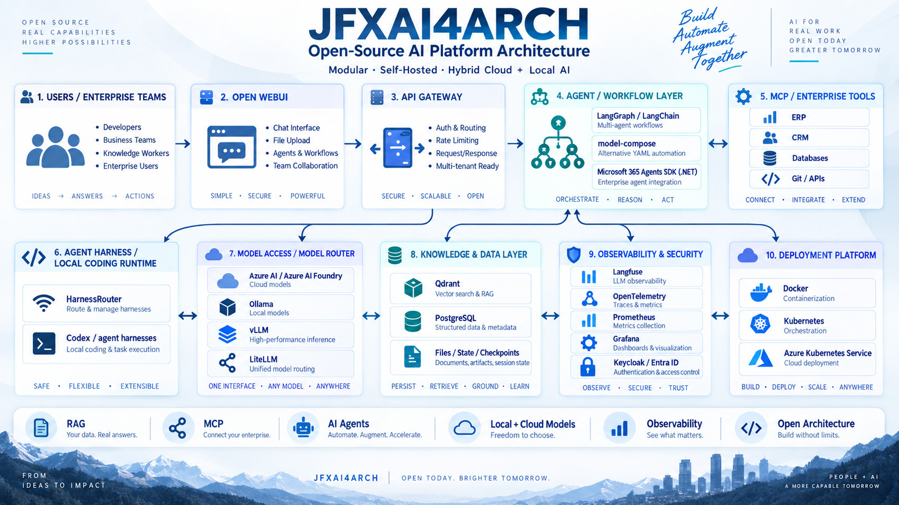

<p align="center">
  
</p>

<p align="center">
  <em>
    Open-source AI architecture for local, private and hybrid-cloud inference,
    integrating gpt-oss, LangGraph, LangChain, MCP, RAG, Qdrant, PostgreSQL,
    Azure AI, observability and cloud-native deployment.
  </em>
</p>

# Open-Source AI Platform Architecture

> Modular, self-hosted and cloud-native reference architecture for enterprise AI agents, Retrieval-Augmented Generation (RAG), Model Context Protocol (MCP), hybrid cloud/local inference, and device-level open-weight reasoning with **OpenAI gpt-oss**.

---

## 1. Description and Context

JFXAI4ARCH is an open-source reference architecture for building replaceable, self-hosted and cloud-native artificial-intelligence platforms.

The architecture is organized around:

- Open WebUI for the human-facing AI portal;
- FastAPI for API and service interfaces;
- LangGraph and LangChain for agent and workflow orchestration;
- Model Context Protocol (MCP) for tool and enterprise-system interoperability;
- Azure AI / Azure AI Foundry for managed inference;
- local and open-weight language models;
- Ollama, vLLM and related runtimes for self-hosted inference;
- Qdrant for vector retrieval;
- PostgreSQL for application, workflow and state data;
- Keycloak / Microsoft Entra ID for identity;
- Langfuse, OpenTelemetry, Prometheus and Grafana for observability;
- Docker and Kubernetes / AKS for deployment;
- GitHub Actions and Argo CD for CI/CD and GitOps.

This version extends the hybrid inference architecture with **gpt-oss-20b** as the preferred local/device reasoning model and **gpt-oss-120b** as an optional high-capacity private-infrastructure profile.

The guiding principle remains:

> **Open, modular architecture designed to minimize proprietary lock-in and enable independent implementations.**

---

## 2. Objectives

The architecture is intended to:

1. Provide a reusable enterprise AI platform blueprint.
2. Support autonomous and semi-autonomous agents.
3. Integrate enterprise tools and systems through MCP.
4. Support RAG over enterprise knowledge.
5. Enable cloud, datacenter, workstation and edge/device inference.
6. Keep model providers replaceable.
7. Support privacy-sensitive and disconnected deployments.
8. Scale through containers and Kubernetes.
9. Separate orchestration from model execution and enterprise integrations.
10. Provide traceability, observability, evaluation and human oversight.
11. Enable local reasoning on supported devices with gpt-oss.
12. Provide controlled escalation from local models to private-cloud or managed-cloud models.

---

## 3. Architectural Principles

- **Open-source first**
- **API first**
- **Cloud native**
- **Container first**
- **Kubernetes ready**
- **Model agnostic**
- **Vendor neutral**
- **Local-first where appropriate**
- **Security by design**
- **Human-in-the-loop**
- **Replaceable components**
- **Observable AI**
- **Reproducible deployment**
- **Graceful offline operation**
- **Data-residency awareness**
- **Policy-based model routing**

---

## 4. High-Level Architecture

```text
                         USERS
          Employees / Customers / Developers
                            |
                            v
                    +----------------+
                    |   OPEN WEBUI   |
                    | Chat / RAG /   |
                    | Models / Roles |
                    +-------+--------+
                            |
                            v
                    +----------------+
                    |  API GATEWAY   |
                    | FastAPI / RBAC |
                    | Audit / Limits |
                    +-------+--------+
                            |
                            v
              +-----------------------------+
              |  AGENT / WORKFLOW LAYER     |
              | LangGraph / LangChain       |
              | Human Approval / State      |
              +--------------+--------------+
                             |
             +---------------+----------------+
             |               |                |
             v               v                v
       +-----------+    +-----------+    +--------------+
       |    MCP    |    |    RAG    |    | MODEL ROUTER |
       | Servers   |    | Pipeline  |    | Policy-based |
       +-----+-----+    +-----+-----+    +------+-------+
             |                |                 |
             v                v                 v
       Enterprise         Qdrant /        +-----+----------------------+
       Systems            Embeddings      |                            |
                                          v                            v
                                  LOCAL / DEVICE AI              CLOUD AI
                                  gpt-oss-20b                    Azure AI
                                  Ollama / llama.cpp             Azure Foundry
                                  LM Studio / ONNX               hosted models
                                          |
                                          v
                                  PRIVATE SERVER AI
                                  gpt-oss-120b
                                  vLLM / GPU / K8s
                                          |
                                          v
                                 +----------------+
                                 | DATA PLATFORM  |
                                 | PostgreSQL     |
                                 | Qdrant         |
                                 +-------+--------+
                                         |
                                         v
                              +----------------------+
                              | Docker / Kubernetes  |
                              | Edge / On-Prem / AKS |
                              +----------------------+
```

---

## 5. AI Agent Platform

### Open WebUI

Open WebUI remains the primary optional enterprise AI portal for:

- conversational AI;
- local/cloud model selection;
- document upload;
- RAG;
- knowledge retrieval;
- user and role management;
- API integration;
- self-hosted deployment.

### LangGraph / LangChain

The orchestration layer coordinates:

- multi-step workflows;
- agent routing;
- tool use;
- persistent state;
- conditional execution;
- retries and recovery;
- human approval;
- multi-agent collaboration;
- long-running workflows.

Example:

```text
User Request
     |
     v
Request Classification
     |
     +---- Knowledge Question ---> RAG
     |
     +---- Business Action ------> MCP Tool
     |
     +---- Local Reasoning ------> gpt-oss-20b
     |
     +---- Complex / Escalated --> Private/Cloud Model
```

---

## 6. Model Context Protocol (MCP)

MCP provides a standardized integration boundary between agents and external systems.

Potential integrations include:

- PostgreSQL;
- ERP;
- CRM;
- e-commerce platforms;
- REST APIs;
- Git;
- file systems;
- Azure services;
- business applications;
- legacy systems;
- local device tools.

```text
LangGraph Agent
      |
      v
  MCP Client
      |
+-----+------------+-------------+
|                  |             |
v                  v             v
Database MCP    Business MCP   Device MCP
|                  |             |
v                  v             v
PostgreSQL      ERP / APIs    Files / OS /
                              Local Tools
```

The local gpt-oss model can use the same MCP-mediated tool layer as cloud models, subject to the same authorization and approval policies.

---

# 7. Hybrid AI Model Strategy

JFXAI4ARCH should treat inference as a **routing problem**, not as a single-model dependency.

```text
                          MODEL ROUTER
                               |
        +----------------------+----------------------+
        |                      |                      |
        v                      v                      v
   DEVICE / EDGE          PRIVATE SERVER          CLOUD AI
   gpt-oss-20b            gpt-oss-120b            Azure AI
   local reasoning        high-capacity           managed models
   private RAG            private reasoning       elastic workloads
   offline capable        datacenter / K8s        external services
        |
        v
 Small / Specialized Models
 classification / extraction / embeddings
```

## Workload Matrix

| Workload | Preferred Strategy |
|---|---|
| General private chat | gpt-oss-20b local |
| Internal RAG | gpt-oss-20b + Qdrant |
| Offline assistant | gpt-oss-20b |
| Device/edge reasoning | gpt-oss-20b where hardware permits |
| Local tool-using agent | gpt-oss-20b + MCP |
| Software/engineering assistant | gpt-oss-20b + MCP + local workspace |
| High-capacity private reasoning | gpt-oss-120b |
| Datacenter inference | gpt-oss-120b + vLLM |
| High-volume classification | Smaller specialized local model |
| Managed cloud workload | Azure AI / Azure AI Foundry |
| High-risk action | AI + policy + human approval |

---

# 8. gpt-oss Local / Device Inference

## 8.1 Role in JFXAI4ARCH

**gpt-oss-20b** becomes the primary candidate for the **Local Device Reasoning** building block.

Its architectural purpose is to provide:

- local reasoning;
- private RAG;
- offline or intermittently connected operation;
- local tool use;
- structured extraction;
- coding and engineering assistance;
- edge-side document analysis;
- privacy-sensitive enterprise assistants;
- development and rapid prototyping.

The model is not coupled directly to applications. It sits behind a local model gateway.

```text
Application / Agent
        |
        v
Local Model Gateway
        |
        +------------------------------+
        |                              |
        v                              v
   gpt-oss-20b                  Specialized Models
   reasoning                    embedding/classifier
        |
        v
Inference Runtime
Ollama / llama.cpp / LM Studio
ONNX Runtime / Foundry Local
Metal / PyTorch reference paths
```

## 8.2 Device Profile

OpenAI describes gpt-oss-20b as an open-weight reasoning model intended for low-latency, local and specialized use cases.

A practical JFXAI4ARCH device profile is:

```yaml
profile: device-local-ai

model:
  family: gpt-oss
  model: gpt-oss-20b
  role: local-reasoning

inference:
  preferred_runtime:
    - Ollama
    - llama.cpp
    - LM Studio
    - ONNX Runtime / Foundry Local
  alternative_runtime:
    - PyTorch
    - Metal

services:
  - local-model-gateway
  - rag-service
  - mcp-client
  - policy-service
  - audit-service

data:
  - local-qdrant
  - local-or-private-postgresql

network:
  offline_capable: true
  cloud_escalation: optional
```

## 8.3 Hardware Planning

The gpt-oss family contains:

| Model | Architectural Profile | Memory Target |
|---|---|---:|
| **gpt-oss-20b** | Device / workstation / edge | ~16 GB class |
| **gpt-oss-120b** | Private server / datacenter | ~80 GB class |

These are model-memory targets published for the native quantized releases; actual end-to-end application requirements also depend on runtime, context, KV cache, concurrency, operating system, GPU/accelerator configuration and surrounding services.

## 8.4 Device Categories

### Developer Workstation

```text
Open WebUI
   |
LangGraph
   |
Local Model Gateway
   |
Ollama / LM Studio
   |
gpt-oss-20b
   |
Qdrant + PostgreSQL
```

### Windows AI Device

```text
JFXAI4ARCH Client
      |
Local AI Gateway
      |
Foundry Local / ONNX Runtime
      |
gpt-oss-20b
      |
Local RAG / MCP Tools
```

### Apple / Metal Development Profile

```text
Local App
   |
Model Adapter
   |
Metal-compatible inference path
   |
gpt-oss
```

### Edge / Field Node

```text
Sensor / User / Local Data
        |
        v
Edge Application
        |
        v
gpt-oss-20b
        |
        +---- Local RAG
        +---- MCP Tools
        +---- Structured Output
        |
        v
Local Decision Support
        |
optional sync
        v
Enterprise Platform
```

---

# 9. Private Server Inference — gpt-oss-120b

gpt-oss-120b is positioned as a **high-capacity private inference tier** rather than the default device model.

```text
Enterprise Agents
       |
Model Router
       |
Private Inference API
       |
vLLM
       |
gpt-oss-120b
       |
GPU Server / Kubernetes
```

Use cases:

- complex private reasoning;
- centralized enterprise RAG;
- high-value agent workflows;
- larger-context analytical workloads;
- private datacenter deployments;
- workloads that should not leave controlled infrastructure.

---

# 10. Local Model Gateway

The local model gateway should isolate applications from runtime-specific details.

Responsibilities:

- OpenAI-compatible or project-defined API façade;
- model discovery;
- health checks;
- context/token policy;
- request routing;
- structured-output normalization;
- tool-call normalization;
- timeout/retry policy;
- device capability detection;
- local/cloud fallback;
- telemetry;
- audit metadata.

```text
Agent
  |
  v
Local Model Gateway
  |
  +---- gpt-oss-20b / Ollama
  +---- gpt-oss-20b / llama.cpp
  +---- gpt-oss-20b / LM Studio
  +---- gpt-oss / ONNX
  +---- gpt-oss-120b / vLLM
  +---- Azure AI fallback
```

---

# 11. Policy-Based Model Routing

A policy engine decides whether a request should remain local or be escalated.

Example logic:

```text
Incoming Request
      |
      v
Data Classification
      |
      +---- Restricted / Private
      |          |
      |          v
      |     Local gpt-oss
      |
      +---- Offline
      |          |
      |          v
      |     Local gpt-oss
      |
      +---- Normal Enterprise
      |          |
      |          v
      |    Local first
      |
      +---- Complex / Approved Escalation
                 |
                 v
          Private 120b / Azure AI
```

Recommended routing criteria:

- data sensitivity;
- connectivity;
- device capability;
- latency;
- cost;
- reasoning complexity;
- context requirements;
- model evaluation score;
- user policy;
- regulatory/data-residency constraints.

---

# 12. Retrieval-Augmented Generation

The RAG architecture remains independent of the model family.

```text
Enterprise Documents
        |
Document Processing
        |
Text Extraction / Chunking
        |
Embedding Model
        |
Qdrant
        |
Semantic Retrieval
        |
Context Assembly
        |
+-------+------------------+
|                          |
v                          v
gpt-oss-20b             Cloud Model
Local / Private         Approved Route
|                          |
+-------------+------------+
              |
       Grounded Response
```

This enables the same RAG corpus to serve local gpt-oss, private-server models and approved cloud models.

---

# 13. Data Architecture

## PostgreSQL

Suggested domains:

```text
PostgreSQL
├── Users
├── Organizations
├── Roles
├── Permissions
├── Agent Configurations
├── Conversations
├── Workflow Executions
├── Business Records
├── Audit Logs
├── Application Settings
├── Agent State / Checkpoints
├── Model Routing Policies
├── Device Profiles
└── Inference Audit Metadata
```

## Qdrant

Qdrant remains the primary vector-retrieval layer for:

- semantic search;
- similarity;
- metadata filtering;
- hybrid retrieval;
- enterprise documents;
- model-independent RAG.

---

# 14. Optional Agent Architecture Extensions

The following components can remain optional, replaceable extensions:

| Component | Role |
|---|---|
| **model-compose** | Declarative YAML composition of models, agents and services |
| **HarnessRouter** | Routing/normalization of local agent harnesses |
| **Microsoft 365 Agents SDK (.NET)** | Enterprise agents for Microsoft 365 / Teams / .NET ecosystems |
| **LiteLLM** | Provider-neutral model gateway |
| **Open WebUI** | Self-hosted AI portal |

Example:

```text
Open WebUI / M365 / Developer Client
                |
                v
     LangGraph / model-compose
                |
      +---------+----------+
      |                    |
      v                    v
     MCP              HarnessRouter
      |                    |
      +---------+----------+
                |
                v
           Model Router
       +--------+---------+
       |                  |
       v                  v
 gpt-oss Local        Azure / Other
```

---

# 15. Updated Software Dependency Compendium

## User Interface

| Software | Role | Classification |
|---|---|---|
| Open WebUI | AI web interface | Core / Optional deployment |
| Dify | Visual AI platform | Optional |
| Flowise | Visual workflow builder | Optional |

## Agent Orchestration

| Software | Role | Classification |
|---|---|---|
| LangGraph | Stateful agent orchestration | Core |
| LangChain | LLM/tool/RAG integration | Core |
| model-compose | Declarative composition | Optional |
| AutoGen | Multi-agent experimentation | Optional |
| Haystack | RAG / AI framework | Optional |

## Model Integration & Inference

| Software / Model | Role | Deployment |
|---|---|---|
| **gpt-oss-20b** | Local/device reasoning | Device / workstation / edge |
| **gpt-oss-120b** | Private high-capacity reasoning | Server / datacenter |
| Ollama | Local model runtime | Development / workstation |
| llama.cpp | Local lightweight inference | Device / workstation |
| LM Studio | Local desktop inference | Workstation |
| vLLM | High-throughput inference | GPU server / Kubernetes |
| ONNX Runtime / Foundry Local | Local Windows inference path | Device / workstation |
| Azure AI | Managed inference | Cloud |
| Azure AI Foundry | Managed AI platform | Cloud |
| LiteLLM | Model-provider abstraction | Optional gateway |

## Open-Weight Model Families

The architecture remains model-agnostic. Candidate families include:

- **gpt-oss**
- Llama
- Qwen
- Mistral
- Gemma

Selection criteria:

- license;
- model size;
- memory requirements;
- context length;
- latency;
- inference cost;
- tool support;
- structured outputs;
- multilingual performance;
- benchmark results;
- privacy requirements;
- device compatibility.

---

# 16. Updated Dependency Matrix

| Component | Category | Required? | Deployment | Main Function |
|---|---|---:|---|---|
| Open WebUI | UI | Recommended | Docker / K8s | AI interface |
| FastAPI | Backend | Yes | Docker / K8s | APIs |
| LangGraph | Agents | Yes | Docker / K8s | Orchestration |
| LangChain | AI framework | Yes | Docker / K8s | LLM integration |
| MCP | Integration | Yes | Device / Docker / K8s | Tool integration |
| Qdrant | RAG | Yes | Local / Docker / K8s | Vector retrieval |
| PostgreSQL | Data | Yes | Local / Docker / Cloud | State and application data |
| **gpt-oss-20b** | Local AI | Recommended | Device / workstation | Local reasoning |
| **gpt-oss-120b** | Private AI | Optional | GPU server / K8s | High-capacity reasoning |
| Ollama | Inference | Optional | Local | Model runtime |
| llama.cpp | Inference | Optional | Device / local | Lightweight inference |
| LM Studio | Inference | Optional | Desktop | Local model runtime |
| vLLM | Inference | Optional | GPU / K8s | Production inference |
| Azure AI | Cloud AI | Optional | Azure | Managed inference |
| Keycloak | Security | Optional | Docker / K8s | IAM |
| Entra ID | Security | Optional | Azure | Enterprise IAM |
| Langfuse | Observability | Recommended | Docker / K8s | AI tracing |
| OpenTelemetry | Observability | Recommended | Local / K8s | Telemetry |
| Prometheus | Monitoring | Recommended | K8s | Metrics |
| Grafana | Monitoring | Recommended | K8s | Dashboards |
| Docker | Infrastructure | Yes | Host / CI | Containers |
| Kubernetes | Infrastructure | Production | K8s | Orchestration |
| Argo CD | DevOps | Recommended | K8s | GitOps |
| GitHub Actions | CI/CD | Recommended | GitHub | Automation |

---

# 17. Recommended Technology Stack

```yaml
frontend:
  - Open WebUI

backend:
  - Python
  - FastAPI

agent_orchestration:
  - LangGraph
  - LangChain

optional_orchestration:
  - model-compose

integration:
  - Model Context Protocol
  - MCP Servers

agent_harness:
  - HarnessRouter

enterprise_agents:
  - Microsoft 365 Agents SDK (.NET)

local_ai:
  device:
    model:
      - gpt-oss-20b
    runtimes:
      - Ollama
      - llama.cpp
      - LM Studio
      - ONNX Runtime / Foundry Local

  private_server:
    model:
      - gpt-oss-120b
    runtime:
      - vLLM

cloud_ai:
  - Azure AI
  - Azure AI Foundry

knowledge_retrieval:
  - Qdrant
  - Embedding Models

application_data:
  - PostgreSQL

authentication:
  - Keycloak
  - Azure Entra ID
  - OpenID Connect

observability:
  - Langfuse
  - OpenTelemetry
  - Prometheus
  - Grafana

containerization:
  - Docker

orchestration:
  - Kubernetes
  - Azure Kubernetes Service

delivery:
  - GitHub Actions
  - Argo CD
```

---

# 18. Deployment Profiles

## Profile A — Minimal Device

```text
Local Application
      |
gpt-oss-20b
      |
llama.cpp / ONNX / local runtime
      |
Local Files / MCP Tools
```

Use when:

- connectivity is limited;
- privacy is important;
- a full platform stack is unnecessary.

---

## Profile B — Developer Workstation

```text
Open WebUI
   |
LangGraph
   |
gpt-oss-20b / Ollama
   |
Qdrant + PostgreSQL
   |
MCP Tools
```

---

## Profile C — Private Enterprise

```text
Open WebUI
      |
FastAPI
      |
LangGraph
      |
Model Router
   +--+----------------+
   |                   |
gpt-oss-20b        gpt-oss-120b
local nodes         vLLM cluster
   |                   |
   +---------+---------+
             |
      Qdrant / PostgreSQL
             |
        MCP Services
```

---

## Profile D — Hybrid Enterprise

```text
                        Model Router
                  +---------+----------+
                  |                    |
                  v                    v
              Local AI             Cloud AI
            gpt-oss-20b           Azure AI
                  |
        Private AI Tier
        gpt-oss-120b
                  |
         Policy / Governance
                  |
       LangGraph + MCP + RAG
```

The default policy can be **local-first**, escalating only when permitted and useful.

---

# 19. Security and Privacy

Local inference introduces additional advantages and responsibilities.

Recommended controls:

- local data processing where required;
- encrypted local storage;
- secure model artifact storage;
- signed/verified model packages where available;
- restricted MCP tool permissions;
- least-privilege execution;
- sandboxing for code/tool execution;
- prompt and tool-call audit trails;
- secrets isolation;
- network egress policy;
- device compliance;
- model/runtime vulnerability management;
- supply-chain review;
- explicit cloud-escalation policy.

Do not assume that local inference is automatically secure; endpoint security, model/runtime provenance, data handling and tool permissions remain critical.

---

# 20. Observability & Evaluation

Every inference tier should expose comparable telemetry.

```text
User / Agent Request
        |
        v
Model Router
        |
        +---- local gpt-oss
        +---- private gpt-oss
        +---- cloud model
        |
        v
OpenTelemetry
        |
Langfuse
        |
Prometheus
        |
Grafana
```

Track:

- selected model;
- selected runtime;
- route reason;
- latency;
- token/context consumption;
- tool calls;
- retrieval evidence;
- errors/retries;
- policy decisions;
- human approvals;
- evaluation results;
- device resource utilization.

---

# 21. Suggested Repository Structure

```text
jfxai4arch/
├── README.md
├── MBSE/
│   └── CAS/
│       └── Drawio/
├── docs/
│   ├── architecture/
│   ├── models/
│   │   └── gpt-oss/
│   ├── device-inference/
│   ├── mcp/
│   ├── rag/
│   ├── security/
│   └── deployment/
├── services/
│   ├── api-gateway/
│   ├── agent-orchestrator/
│   ├── local-model-gateway/
│   ├── rag-service/
│   ├── model-router/
│   └── audit-service/
├── config/
│   ├── device-profiles/
│   ├── model-routing/
│   ├── mcp/
│   └── model-compose/
├── deploy/
│   ├── local/
│   ├── edge/
│   ├── docker/
│   └── kubernetes/
└── tests/
    ├── models/
    ├── routing/
    ├── rag/
    └── integration/
```

---

# 22. Roadmap

## Phase 1 — Baseline Platform

- Open WebUI
- FastAPI
- LangGraph / LangChain
- MCP
- Qdrant
- PostgreSQL

## Phase 2 — gpt-oss Device Profile

- add gpt-oss-20b;
- implement local model gateway;
- validate Ollama / llama.cpp / LM Studio / ONNX paths;
- define device capability profiles;
- add offline RAG.

## Phase 3 — Policy-Based Hybrid Routing

- local-first routing;
- privacy rules;
- fallback/escalation;
- local/private/cloud workload policies.

## Phase 4 — Private High-Capacity Inference

- gpt-oss-120b;
- vLLM;
- GPU server/Kubernetes deployment;
- load and concurrency testing.

## Phase 5 — Agent Tooling

- MCP-based local tools;
- HarnessRouter;
- coding/engineering workspaces;
- human approval gates.

## Phase 6 — Enterprise Channels

- Microsoft 365 Agents SDK (.NET);
- Teams / M365 integrations;
- enterprise identity.

## Phase 7 — Observability & Governance

- Langfuse;
- OpenTelemetry;
- Prometheus;
- Grafana;
- model and route evaluation.

## Phase 8 — Production Hardening

- device security;
- runtime hardening;
- model validation;
- supply-chain checks;
- backup/recovery;
- high availability;
- GitOps.

---

# 23. gpt-oss Integration Summary

```text
                      JFXAI4ARCH
                           |
              +------------+------------+
              |                         |
              v                         v
         AI WORKFLOWS              ENTERPRISE TOOLS
      LangGraph / LangChain             MCP
              |                         |
              +------------+------------+
                           |
                           v
                     MODEL ROUTER
                           |
       +-------------------+-------------------+
       |                   |                   |
       v                   v                   v
 DEVICE / EDGE       PRIVATE DATACENTER      CLOUD
 gpt-oss-20b         gpt-oss-120b           Azure AI
       |                   |                   |
 Ollama/llama.cpp          vLLM             Managed
 LM Studio/ONNX            GPU/K8s           Models
       |                   |                   |
       +-------------------+-------------------+
                           |
                           v
                RAG / DATA / OBSERVABILITY
              Qdrant / PostgreSQL / Langfuse
```

The key architectural addition is not merely another model entry. It is a dedicated **device/local inference tier** that makes privacy-sensitive, offline-capable and low-latency reasoning a first-class deployment profile.

---

# 24. Licensing and Model Status

The gpt-oss models are open-weight models released by OpenAI under the Apache 2.0 license, subject to the applicable gpt-oss usage policy.

They are designed to run on infrastructure controlled by the user or through third-party hosting/inference providers.

The architecture should keep model artifacts, runtime software and associated licenses documented independently because:

- model license and runtime license may differ;
- optional integrations may have different distribution requirements;
- hardware/runtime support changes over time;
- local deployment does not remove security, privacy or governance responsibilities.

---

# 25. Disclaimer

JFXAI4ARCH is a reference architecture and engineering project.

It does not by itself certify any deployment as secure, compliant, production-ready or appropriate for safety-critical use.

AI outputs, agent actions and local-device decisions should be validated according to the risk and regulatory requirements of the target domain.

Open-source or open-weight availability does not guarantee freedom from all third-party intellectual-property rights in every jurisdiction.

---

# 26. Strategic Direction

With gpt-oss integrated, the architecture evolves from:

```text
Cloud AI + Local LLM
```

to:

```text
Device AI
   +
Private Datacenter AI
   +
Cloud AI
   +
Policy-Based Routing
   +
MCP Tooling
   +
RAG
   +
Observability
```

This makes JFXAI4ARCH a stronger reference architecture for **distributed AI**, where the same agent platform can operate across laptops, workstations, edge nodes, private servers and cloud infrastructure while preserving a common orchestration, data, security and governance model.
