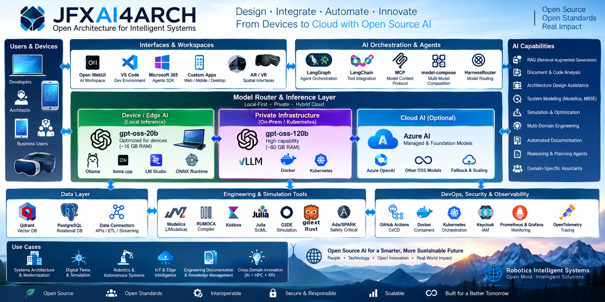

<p align="center">

</p>

# On-Premise AI and Technical Knowledge Platform

**Local RAG · GLiNER2 document intelligence · Technical bibliography · Private inference · MCP · Evidence and provenance**

**Consolidated architecture proposal · 12 September 2026**

JFXAI4ARCH provides a modular reference architecture for enterprise AI agents, local and private model inference, Retrieval-Augmented Generation (RAG), and controlled integration with enterprise tools. This edition expands its existing RAG architecture with **GLiNER2 as a local information-extraction subsystem** and a document/bibliography pipeline designed for technical knowledge held on infrastructure controlled by the organization.

The resulting platform can ingest technical documents, recover their structure, extract entities and reference metadata, build searchable evidence indexes, and answer questions with source passages and reproducible citations. GLiNER2 enriches the evidence; a separate embedding model supports semantic retrieval, and a separate local language model generates answers.

**Delivery status:** this Markdown and its companion `jfxai4arch_gliner2_onpremise_rag.drawio` define the proposed integration. They do not install services, publish repository changes, or establish measured extraction/RAG quality. The local Python example is an integration recipe, not a completed application.

## 1. Source baseline and merge policy

| Source | Reviewed revision | Verified scope | Use in this consolidation |
|---|---|---|---|
| `robotics-intelligent-systems/jfxai4arch` | `26f2fdb22d6a235799f2b03f2b4ae17ae99f1bc5` | README reference architecture, Draw.io diagrams and architecture image; no executable platform service tree in the inspected snapshot | Preserve platform, inference, data, MCP, identity, observability and deployment layers |
| `sdk2035/GLiNER2` | `3c913c7369301133d3b7699252074c4303ada50e` | Fork of `fastino-ai/GLiNER2`; Python package, model/inference code, schemas, training utilities, tests and Apache-2.0 license | Add a versioned, replaceable extraction worker based on this exact fork |

Sources: [JFXAI4ARCH pinned README](https://github.com/robotics-intelligent-systems/jfxai4arch/blob/26f2fdb22d6a235799f2b03f2b4ae17ae99f1bc5/README.md), [JFXAI4ARCH snapshot](https://github.com/robotics-intelligent-systems/jfxai4arch/tree/26f2fdb22d6a235799f2b03f2b4ae17ae99f1bc5), [requested GLiNER2 fork](https://github.com/sdk2035/GLiNER2/tree/3c913c7369301133d3b7699252074c4303ada50e), [fork README](https://github.com/sdk2035/GLiNER2/blob/3c913c7369301133d3b7699252074c4303ada50e/README.md).

The original device, private-server and hybrid-cloud architecture remains part of the project. This edition makes the **strict on-premise profile** the default for technical-document workloads. Azure AI, Entra ID, Microsoft 365 channels and other external integrations remain optional profiles; they are disabled in isolated operation. Private inference can scale from a workstation to a datacenter without changing the evidence contracts.

The fork's package declares `__version__ = "2.0.0"`, while its README/code also expose GLiNER2.5 boundary extractors. Package version, model-family name and checkpoint architecture are different identifiers. Pin the fork commit and checkpoint revision independently; an unqualified `pip install gliner2` does not establish that the requested fork has been installed. [Package surface](https://github.com/sdk2035/GLiNER2/blob/3c913c7369301133d3b7699252074c4303ada50e/gliner2/__init__.py).

## 2. Objectives and representative use cases

1. Keep technical documents, embeddings, extraction results, prompts and inference inside the selected private boundary.
2. Answer technical questions using authorized, versioned source passages.
3. Extract searchable entities, document categories, terminology and candidate relationships with GLiNER2.
4. Manage papers, manuals, specifications, standards, reports and bibliographic records with explicit provenance.
5. Support Spanish and English corpora through evaluated multilingual extraction, embedding and generation profiles.
6. Preserve exact identifiers, units, tables, code fragments and document editions during processing.
7. Make ingestion, indexing, model changes and citation generation reproducible and reviewable.
8. Support local development first, then controlled on-premise deployment and optional model adaptation.

| Use case | User-visible result | Evidence requirement |
|---|---|---|
| Technical document Q&A | Explanation with passages, page/section locators and source version | Every factual technical claim must be supported or marked unresolved |
| Literature review | Evidence matrix grouped by method, topic and document | Distinguish consulted full text, imported abstracts and reference-only records |
| Standards/specification comparison | Edition-aware comparison of cited clauses | Preserve edition, clause ID, applicability and source access rights |
| Component/material research | Searchable mentions of products, materials, quantities and methods | Extraction is a candidate annotation; it does not certify equivalence or suitability |
| Bibliography preparation | Reviewed BibTeX, RIS or CSL-JSON export | Deterministic serialization of curated records; missing fields remain missing |
| Engineering knowledge reuse | Links between requirements, decisions, methods and source passages | Link provenance and uncertainty survive graph/metadata enrichment |

## 3. Architectural principles

Preserve modular APIs, replaceable models, stateful orchestration, controlled MCP tools, human review, portable containers and observable operation from JFXAI4ARCH. Add the following knowledge-specific rules:

- **One governed retrieval path:** all clients use the same document authorization and evidence service.
- **Local operation is explicit:** network policies enforce the selected deployment boundary.
- **Originals are immutable:** every parse, correction, annotation and index is derived from an identified document version.
- **Extraction, retrieval and generation are distinct:** each has its own model identity, tests and failure modes.
- **References are not automatically evidence:** a bibliography entry does not mean the cited work has been read.
- **Authorization precedes retrieval:** denied content never reaches reranking, generation, caches or traces.
- **Candidate annotations remain candidates:** confidence scores do not establish truth, permission or technical compliance.
- **Missing evidence is a valid outcome:** the assistant can explain that the available corpus is insufficient.

## 4. Integrated platform architecture

| Layer | Retained JFXAI4ARCH components | New or expanded responsibility |
|---|---|---|
| Experience | Open WebUI or another approved client | Technical search, source viewer, bibliography workspace and annotation review |
| API and policy | FastAPI gateway, identity, limits and audit | Document ACLs, corpus/version selection, ingestion jobs and citation contracts |
| Orchestration | LangGraph; LangChain adapters where useful | Ingest/parse/extract/index workflows; query/retrieve/rerank/answer/cite workflows |
| Document processing | Expanded RAG ingestion capability | Local document parser/OCR, scholarly parser and canonical document representation |
| Information extraction | Specialized local-model tier | GLiNER2 worker: entities, classifications, structured records and candidate relations |
| Retrieval | Qdrant and PostgreSQL | Dense retrieval, lexical search, curated metadata, bibliography and evidence mappings |
| Generation | Local model gateway and policy router | Private answer generation from authorized evidence; retrieval-only degraded mode |
| Integration | MCP and enterprise adapters | Read-only corpus search, source lookup, bibliography export and reviewed ingestion tools |
| Operations | Containers, private orchestration, telemetry and CI/CD | Artifact mirrors, no-egress testing, index/model manifests, restore and deletion controls |

The retrieval service owns document authorization and evidence assembly. Open WebUI's independent upload/RAG paths must be disabled or explicitly integrated with that service so that a second index cannot bypass ACLs or version selection. The UI can change without changing the knowledge boundary.

### 4.1 Service decomposition

| Proposed service | Owns | Main interfaces |
|---|---|---|
| `knowledge-api` | Access policy, request admission and evidence API | Authenticated HTTP; restricted MCP façade |
| `ingestion-worker` | Job state, file validation, hashing and source registration | Job queue and object-store references |
| `document-parser` | Layout/text/OCR conversion and location maps | Canonical document + parser provenance |
| `bibliography-service` | Work/edition records, reference mentions and reviewed matches | Import, review, resolution and export |
| `gliner2-worker` | Extraction runs and candidate annotations | Versioned schemas + canonical text → span-based results |
| `indexer` | Retrieval chunks, embeddings and index generations | PostgreSQL lexical index + Qdrant collections |
| `rag-orchestrator` | Query workflow, evidence context and answer/citation validation | Retrieval, reranking and local model gateway |
| `local-model-gateway` | Generation endpoint and runtime routing | Approved local/private model profiles |
| `evaluation-worker` | Corpus-specific extraction and RAG evaluations | Versioned datasets, metrics and release reports |

These are logical boundaries. A workstation MVP can package several inside one backend plus workers. Do not require Kubernetes or one microservice per box before workload and isolation needs justify it.

## 5. GLiNER2 subsystem: capabilities and limits

The requested fork implements schema-conditioned extraction through local encoder models. It includes entity extraction, classification, structured records, relations, batch processing, long-document APIs and training utilities. Its `AutoExtractor` reads the saved checkpoint architecture; `GLiNER2` is a legacy span-only alias. Boundary checkpoints require the architecture-dispatching loader. [Fork README](https://github.com/sdk2035/GLiNER2/blob/3c913c7369301133d3b7699252074c4303ada50e/README.md), [loader implementation](https://github.com/sdk2035/GLiNER2/blob/3c913c7369301133d3b7699252074c4303ada50e/gliner2/auto.py).

| Capability | Proposed technical-document use | Limit or review condition |
|---|---|---|
| Named entities | Components, materials, methods, organizations, standard references and quantities | Domain labels need representative evaluation; a detected string is not a verified catalog identity |
| Classification | Manual, paper, specification, report; subject tags | Classification is advisory and must never assign access permissions |
| Structured records | Candidate experiment, component or reference metadata | Preserve missing fields, conflicting values, text spans and source context |
| Relations | Candidate `uses_method`, `mentions_standard`, `reports_quantity`, `cites_work` | Do not infer cross-document identity or graph truth from surface strings alone |
| Confidence and offsets | Annotation review and exact text highlighting | Scores are not calibrated probabilities by default; offsets refer to input text, not PDF coordinates |
| Long-document extraction | Full-document scans with overlapping windows | Window limits still apply; no guarantee for mentions/relations spanning disjoint windows |
| Fine-tuning / LoRA | Domain terminology adaptation on approved local data | Requires held-out evaluation, checkpoint compatibility and controlled deployment |

GLiNER2 is **not** the PDF parser, OCR engine, bibliography authority, embedding service, vector database or answer generator. The standard extraction model is also not a complete PII-redaction or prompt-injection defense. Specialty models and deterministic controls are separate components.

### 5.1 Checkpoint strategy

| Profile | Candidate checkpoint | Rationale | Qualification |
|---|---|---|---|
| Mixed Spanish/English technical corpus | `fastino/gliner2.5-multi-v1` | Multilingual boundary checkpoint documented by its model card | Benchmark both languages, technical notation, records and relation heads |
| English extraction baseline | `fastino/gliner2-base-v1` | Established span checkpoint for comparison | Do not assume multilingual coverage or unlimited entity span width |
| English boundary comparison | `fastino/gliner2.5-base-v1` | Boundary option described in the fork | Evaluate against the same corpus and compute budget |
| Domain-adapted extraction | Locally trained checkpoint/adapter | Vocabulary and annotation-style adaptation | Promote only after blind test, error review and rollback preparation |

The multilingual model card identifies a 287M-parameter checkpoint and an Apache-2.0 license; the base span card identifies a 205M-parameter English checkpoint under Apache-2.0. These are checkpoint descriptions, not measured RAM, throughput or technical-domain accuracy guarantees. [Multilingual model card](https://huggingface.co/fastino/gliner2.5-multi-v1), [base span model card](https://huggingface.co/fastino/gliner2-base-v1).

## 6. Document and bibliography ingestion

### 6.1 Input routing

| Input | Proposed processing route | Preserve |
|---|---|---|
| Born-digital PDF manuals/reports/specifications | Local layout-aware parser, with Docling as a candidate | Reading order, headings, tables, source pages and geometry |
| Scanned PDF/images | Local OCR in the selected parser pipeline | Page image, OCR text, language, quality and coordinates |
| Scientific/technical papers | Local scholarly parsing with GROBID, optionally alongside layout parsing | Header metadata, reference entries, citation callouts and TEI structure |
| DOCX, Markdown, HTML and plain text | Format-specific local adapters into the canonical representation | Sections, lists, tables, code and stable source locators |
| BibTeX, RIS, CSL-JSON | Structured import and validation | Original record, imported fields, source and review state |
| Repository technical documentation | Read-only import pinned to a commit or release | Repository, path, revision, section/line locator and rights |
| Formula- or drawing-heavy material | Preserve the original plus a qualified specialist parsing route | Unparsed content remains visible and flagged; prose extraction is not engineering interpretation |

GROBID can extract scientific-document structure and bibliographic information into XML/TEI, including citation contexts and coordinates. Docling provides configurable local conversion/OCR and supports prefetching model artifacts for offline use. Their outputs require corpus-level quality checks. [GROBID introduction](https://grobid.readthedocs.io/en/latest/Introduction/), [Docling offline configuration](https://docling-project.github.io/docling/usage/advanced_options/).

### 6.2 Ingestion lifecycle

1. **Register and quarantine:** authenticate the uploader; record rights, tenant/project ACLs, source URI, media type, size and original-byte hash. Apply resource limits and isolate parsers.
2. **Create a document version:** recognize exact duplicates without merging access scopes. Distinguish a new edition from another copy of the same edition.
3. **Parse locally:** generate text/layout and quality reports. Select one canonical text revision; keep other parser outputs as evidence rather than concatenating duplicate text.
4. **Map locations:** connect canonical spans to PDF page index, printed page label, bounding boxes or format-specific section/line locators. Preserve normalization/dehyphenation mappings.
5. **Extract and normalize:** run versioned GLiNER2 schemas; deterministic validators identify possible identifiers/units; route conflicts and uncertain records to review.
6. **Process references:** preserve raw reference text; match only against authorized local bibliography/full-text records; maintain unmatched references explicitly.
7. **Build indexes:** create retrieval chunks, lexical entries, local embeddings and optional relation projections, each tied to the document/text version and ACL revision.
8. **Publish one index generation:** expose a consistent snapshot after all required stores are ready. Failed/partial jobs remain unsearchable or explicitly degraded.

Use idempotent job keys derived from document version, parser/schema/model versions and target index generation. Reprocessing creates derived revisions; it does not rewrite the original. A GLiNER2 failure may permit a labelled raw-text-only index if policy allows; it must not silently publish incomplete “verified” metadata.

### 6.3 Canonical document representation

| Record | Required fields / relationships |
|---|---|
| `Document` | Stable identity, owning project, source and access policy |
| `DocumentVersion` | Original hash, revision/edition, media type, rights and ingestion provenance |
| `TextRevision` | Parser/OCR versions, normalization policy, canonical text hash and quality |
| `Block` | Section hierarchy, text range, reading order and page/geometry mappings |
| `Chunk` | Text revision, block/range references, tokenizer/embedding profile and ACL revision |
| `ExtractionRun` | Fork commit, checkpoint revision/hash, schema, thresholds, language and runtime settings |
| `Mention` | Entity type, exact input substring, half-open offsets, source locator, score and review state |
| `RelationCandidate` | Endpoint mention IDs, relation schema, evidence span/window and validation status |
| `BibliographicWork` | Curated title/creators/date/identifiers; separate manifestations/editions |
| `ReferenceMention` | Citing document, raw reference text, callouts, candidate work match and resolution state |
| `EvidenceCitation` | Claim/passage association, document version, locator, authorization and consulted status |

The canonical text is the offset authority. For Python strings, offsets are Unicode code-point indices with an exclusive end; adapters must translate deliberately for JavaScript UTF-16 highlighting. Store enough mapping to return to the source; never label a character index as a PDF page coordinate.

## 7. Technical extraction schemas and normalization

Start with a small schema and expand only after error analysis. Broad schemas and long descriptions consume model input budget and can reduce extraction quality.

| Schema group | Example fields / labels | Additional processing |
|---|---|---|
| Technical mentions | `software_component`, `material`, `method`, `standard_reference`, `physical_quantity`, `organization` | Candidate catalog linking, units and identifier parsing |
| Document description | Type, subject, language, edition candidate | Prefer trusted source metadata for authoritative fields |
| Bibliographic candidates | Title, author, year, venue, DOI/arXiv/ISBN candidate | Structured parser + deterministic validation + curated local matching |
| Requirements | Requirement ID, modality, condition, measured quantity and clause locator | Specialist review; extraction does not establish compliance |
| Experiments/results | Method, dataset, conditions, quantity and unit | Preserve negation, uncertainty and table headers; no context-free comparisons |
| Candidate relations | Method/component associations and reference links | Typed endpoints, evidence windows and review before graph promotion |

A DOI-shaped string is not a verified DOI record. ISBN checksum validity does not establish that the edition is correct. Material names, trade names and standards numbers require version-aware linking. Numeric normalization preserves the original value, unit, sign, tolerance and conditions; uncertain conversions stay unresolved.

Use separate fields for `extracted_value`, `normalized_value`, `reviewed_value`, `confidence`, `evidence_locator` and `validation_status`. Never overwrite source evidence with a model's preferred interpretation.

### 7.1 Long-document behavior

The fork documents `extract_entities_long`, `extract_long`, `extract_json_long`, `extract_relations_long` and batch variants. These scan overlapping windows and remap outputs to global text offsets. In contrast, a short call with `max_len` can truncate the remainder. Window size uses the model's word splitter, not automatically the embedding or LLM tokenizer. [Long-context tutorial](https://github.com/sdk2035/GLiNER2/blob/3c913c7369301133d3b7699252074c4303ada50e/tutorial/12-long_context.md).

Keep **extraction windows** separate from **retrieval chunks**. Budget encoded length for source text plus schema and special tokens; validate against the actual checkpoint. Overlap reduces boundary loss but cannot join a mention whose endpoints never coexist in one window. Deduplicate overlap artifacts by document version, offsets, label and schema while retaining repeated mentions at different positions. Reconcile long-record fragments explicitly; do not merge bibliography records based only on a matching author surname.

## 8. Technical bibliography and citation integrity

### 8.1 Record states

| State | Meaning | Permitted use |
|---|---|---|
| `reference_only` | A work is mentioned in another document or imported as metadata | Discovery list or bibliography candidate; not evidence of its contents |
| `abstract_available` | An authorized abstract is indexed | Claims limited to that abstract, labelled accordingly |
| `full_text_available` | An authorized version has been ingested | Searchable source; a specific answer still needs an actually retrieved passage |
| `metadata_reviewed` | A reviewer/local trusted catalog has accepted bibliographic fields | Curated bibliography export; does not imply scientific validity |
| `consulted_in_answer` | A source passage was used in this answer | Citation can point to the exact passage/version |
| `withdrawn_or_superseded` | Known status or newer edition is recorded | Warn in context and expose status; do not silently replace historical citations |

Availability, metadata review and publication status are separate fields, not mutually exclusive lifecycle states. Resolution must preserve alternative editions, translations, preprints and journal versions. Exact DOI matches can support work linking; fuzzy title/year/author matches remain review candidates. A duplicate text hash does not authorize cross-project sharing.

### 8.2 Offline resolution

Use a curated local catalog and imported bibliography records. Missing metadata remains `null` or absent; record the reason. GROBID's optional consolidation can call external metadata services, so disable it for strict offline operation or connect it only to an explicitly approved local service. Do not follow embedded DOI links or fetch referenced PDFs during normal ingestion. [GROBID consolidation](https://grobid.readthedocs.io/en/latest/Consolidation/).

A separately authorized connected staging process may refresh public metadata, with source, retrieval time and license recorded. Imported metadata does not grant access to the corresponding full text. Current retraction/edition status cannot be guaranteed by a disconnected catalog; show its last synchronization date.

### 8.3 Answer citation contract

Each citation binds a claim to an authorized evidence record: document/work ID, document version/hash, consulted content type, passage/chunk ID, exact locator, quote or excerpt hash, and extraction/retrieval provenance. Display human-readable title, authors/date when available, PDF page index and printed label when different, and section/clause or repository revision as appropriate.

Generate BibTeX/RIS/CSL-JSON from the bibliography service, not by asking the language model to invent citation strings. Citations must resolve to evidence actually supplied to generation. Verify identifier/locator existence deterministically; evaluate whether the passage supports the claim separately. A valid URL or document ID alone does not prove support.

For contradictions, cite both sources and their versions. For unavailable evidence, state the limitation and offer reference discovery without implying consultation. Protect publisher/corpus access rights in source viewers and exports.

## 9. Local RAG query and retrieval architecture

1. **Authenticate and scope:** determine tenant, projects, user groups, corpus versions and allowed document states from trusted identity—not from model output.
2. **Analyze the query locally:** normalize language/identifiers; optionally use GLiNER2 for candidate technical entities and query tags. Preserve the original query.
3. **Retrieve authorized candidates:** run dense search in Qdrant and lexical/full-text search in PostgreSQL with the same access and version constraints.
4. **Fuse and rerank:** combine ranked lists, deduplicate overlapping chunks, then optionally apply a local reranker. Keep scores and provenance by stage.
5. **Assemble evidence:** select relevant passages, necessary table headers/context, nearby definitions and edition metadata within the generator's token budget.
6. **Generate locally:** route to the approved private model with evidence-delimited instructions and controlled tools.
7. **Check support and citations:** reject invented source IDs; flag unsupported claims; abstain or return retrieved evidence when support is insufficient.
8. **Present and audit:** show answer, sources, limitations and index/model versions. Log metadata by default; sensitive text tracing requires explicit policy.

PostgreSQL provides lexical full-text search and ranking; Qdrant provides vector retrieval with payload filters. A fusion strategy such as reciprocal rank fusion can combine the two lists without pretending their raw scores share a scale. This is the proposed application design, not an existing cross-database feature. [PostgreSQL full-text search](https://www.postgresql.org/docs/current/textsearch-intro.html), [Qdrant filtering](https://qdrant.tech/documentation/search/filtering/).

Extracted entity tags improve ranking only if demonstrated by evaluation. Low-confidence tags must not become mandatory search filters. Retain a plain hybrid-retrieval route when extraction is unavailable or unhelpful. Exact part numbers, clause IDs, code tokens and rare identifiers require lexical handling; semantic similarity alone is insufficient.

### 9.1 Authorization and index consistency

Apply trusted ACL/version constraints to both retrieval branches before content leaves their stores. Recheck authorization before context assembly and source download. Graph expansions, bibliography suggestions and result counts are subject to the same policy. Never retrieve everything and filter only the final answer.

PostgreSQL owns document metadata and access decisions. Qdrant payloads and lexical indexes are derived projections. Publish versioned index manifests only after compatible stores are ready; reject a stale ACL revision or validate every candidate against current authority. Cache keys include tenant, authorization context/revision, corpus generation and model profile. Revocation invalidates cached answers and source links as well as search results.

### 9.2 Optional evidence graph

The MVP can store entities and relation candidates in PostgreSQL. A graph database is optional after traversal requirements are demonstrated. Edges retain supporting mentions and review status. Generated or inferred relationships must not be indistinguishable from textual evidence, and a path through the graph is not itself proof of a technical conclusion.

## 10. Local generation and retained model routing

Retain the source's **gpt-oss-20b device/workstation candidate** and optional **gpt-oss-120b private-server candidate** behind a model gateway. Other locally evaluated models remain interchangeable. This consolidation does not assert new hardware minimums or certify every runtime/model combination listed by the original README. [JFXAI4ARCH inference profiles](https://github.com/robotics-intelligent-systems/jfxai4arch/blob/26f2fdb22d6a235799f2b03f2b4ae17ae99f1bc5/README.md).

| Function | Dedicated model/service | Routing rule |
|---|---|---|
| Document structure/OCR | Selected local parser/OCR models | Parser worker only |
| Schema-based extraction | GLiNER2/GLiNER2.5 checkpoint | Local extraction worker |
| Dense representation | Evaluated local embedding model | Same model/version for documents and queries |
| Reranking | Optional local cross-encoder/reranker | Authorized candidate passages only |
| Answer generation | Approved local/private LLM | Strict on-premise gateway; no cloud fallback |
| Bibliographic validation/export | Deterministic service and reviewed catalog | LLM output cannot become authoritative metadata |

The embedding model has its own language coverage, dimensions, normalization and tokenizer contract. Changing it creates a new vector index generation and requires re-embedding; extracted metadata should not force re-embedding unless the embedded text changes. Model size, KV cache, concurrency, parser workloads and CPU/GPU contention determine actual capacity.

If generation is unavailable, return authorized retrieval results and bibliography exports with a clear service status. If extraction is unavailable, permit only the configured raw-text retrieval mode. Do not route confidential content to cloud models as an automatic availability fallback.

## 11. Strict on-premise and local development profiles

| Profile | Placement | Identity and operations | Intended outcome |
|---|---|---|---|
| Local developer | Containers/processes on a workstation; persistent local volumes | Loopback/private access, development credentials, small evaluation corpus | Reproducible ingest → search → answer/citation slice |
| On-premise team server | Private API/UI, CPU workers, optional separate inference GPU, database/index services | Local identity provider, TLS, secrets, quotas and private backups | Shared technical corpus with document-level access |
| Disconnected enterprise | Private registries, wheelhouse, model mirror and internal identity/telemetry | Deny external egress; staged artifact import; offline restore/update process | Operation with no public DNS/API/package/model dependency at runtime |
| Optional hybrid profile | Original project cloud adapters enabled separately | Explicit routing and data-release policy | Preserve source architecture outside the strict on-premise workload |

For a CPU development profile, GLiNER2 extraction can be evaluated independently of a generative LLM. This does not imply that a CPU-only machine will provide interactive generation for the inherited model candidates. Choose hardware after measuring representative document lengths, schemas, language mix, concurrency and required latency.

### 11.1 Supply and runtime planes

The **connected preparation plane** resolves source commits, dependency locks, licenses, checkpoints, tokenizers, encoder configurations, OCR language packs and container images. It builds/tests artifacts and exports a manifest with hashes. Public repositories, package registries and model hubs are acquisition sources, not runtime services for a disconnected deployment.

The **private runtime plane** consumes only approved artifacts from local paths/registries. GLiNER2's `API()` / `GLiNER2API` client is excluded from this profile because it targets hosted extraction; use `AutoExtractor` with a complete local checkpoint. The fork's base package does not include local inference dependencies; the `[local]` extra adds the relevant PyTorch/Transformers stack. [Fork packaging](https://github.com/sdk2035/GLiNER2/blob/3c913c7369301133d3b7699252074c4303ada50e/pyproject.toml).

Set Hub offline mode and disable telemetry for the selected libraries, but also enforce network isolation. Environment flags cover specific libraries, not every service or plugin. Model downloads, OCR artifacts and tokenizer resolution must be tested after removing access to public caches. [Hugging Face environment controls](https://huggingface.co/docs/huggingface_hub/en/package_reference/environment_variables).

### 11.2 Artifact manifest

| Artifact | Pin and verify |
|---|---|
| GLiNER2 source | Requested fork commit, reviewed patches, built wheel hash and test report |
| Python environment | Python/platform profile and complete dependency lock with hashes |
| Extraction checkpoint | Model repository, exact revision, architecture, configuration, weights, tokenizer and encoder-config hashes |
| Parser/OCR | Package/container versions, model artifacts, language packs and settings |
| Embedding/reranker/LLM | Separate model revision, license, runtime, context/dimension settings and evaluation |
| Corpus/index | Document/text hashes, schema version, ACL revision, chunking configuration and index generation |
| Infrastructure | Image digests, configuration revision, secrets references, storage/backup policy and network rules |

Do not rely solely on `local_files_only` being forwarded by every nested loader. The inspected `AutoExtractor` separates Hub resolution options from model options; use complete local checkpoint directories and verify cold-start behavior with egress denied. [Loader](https://github.com/sdk2035/GLiNER2/blob/3c913c7369301133d3b7699252074c4303ada50e/gliner2/auto.py), [checkpoint loading helpers](https://github.com/sdk2035/GLiNER2/blob/3c913c7369301133d3b7699252074c4303ada50e/gliner2/models/loading.py).

## 12. Local development recipe

The following steps are instructions for a future implementation. No model weights or platform runtime were installed during preparation of this architecture package.

### 12.1 Connected bootstrap for the requested fork

```bash
python -m venv .venv
. .venv/bin/activate
python -m pip install 'gliner2[local] @ git+https://github.com/sdk2035/GLiNER2.git@3c913c7369301133d3b7699252074c4303ada50e'
```

This pins source code but not the transitive dependency resolution. For repeatable on-premise delivery, resolve and test a full platform-specific lock, build an approved wheelhouse, record licenses and hashes, and install from that wheelhouse without public indexes. Training uses a separately qualified `[train]` environment. Do not substitute a PyPI version number for proof of fork provenance.

### 12.2 Offline extraction recipe

Assume `/srv/jfxai4arch/models/gliner2-approved` contains a complete, reviewed checkpoint and its tokenizer/encoder assets, and `/srv/jfxai4arch/corpus/example.txt` contains canonical UTF-8 text. Configure offline flags **before importing** model libraries:

```python
import os
os.environ["HF_HUB_OFFLINE"] = "1"
os.environ["HF_HUB_DISABLE_TELEMETRY"] = "1"

import json
from pathlib import Path
from gliner2 import AutoExtractor

checkpoint = Path("/srv/jfxai4arch/models/gliner2-approved")
if not checkpoint.is_dir():
    raise FileNotFoundError("Approved local checkpoint is missing")

model = AutoExtractor.from_pretrained(
    str(checkpoint),
    local_files_only=True,
    map_location="cpu",
)
model.eval()

text = Path("/srv/jfxai4arch/corpus/example.txt").read_text(encoding="utf-8")
labels = {
    "software_component": "Named software package, library or service",
    "standard_reference": "A standard identifier or explicitly named edition",
    "material": "A named engineering material or material grade",
    "method": "A named technical method or algorithm",
    "physical_quantity": "A stated numeric physical value with its unit",
}
result = model.extract_entities_long(
    text,
    labels,
    chunk_size=384,
    chunk_overlap=64,
    include_spans=True,
    include_confidence=True,
)
for mentions in result.get("entities", {}).values():
    for mention in mentions:
        start, end = mention["start"], mention["end"]
        if not (0 <= start < end <= len(text)):
            raise ValueError("Invalid source span")
        if text[start:end] != mention["text"]:
            raise ValueError("Extraction cannot be aligned to the source")

print(json.dumps(result, ensure_ascii=False, indent=2))
```

The 384/64 settings are a starting experiment based on the fork's long-document API, not a guaranteed safe encoded length for every schema or language. Validate the full input budget and truncation behavior. Run this recipe against an approved fixture with egress denied; missing files must produce an error rather than a download. The example only validates string alignment, not semantic correctness, page mapping or extraction accuracy.

### 12.3 Local end-to-end slice

Bring up the private API, PostgreSQL, Qdrant, governed artifact storage, a parser worker, GLiNER2 worker, embedding service and selected generator. Import a small authorized Spanish/English corpus and a curated bibliography fixture. Publish an index generation; ask answerable, unanswerable, exact-identifier and cross-edition questions. Check source highlights and citation exports before adding concurrency, agents or additional formats.

Container definitions, dependency locks, actual service implementations and checkpoint bundles remain implementation deliverables. This README does not present a nonexistent `docker compose up` command as a completed platform.

## 13. Proposed application contracts

| Interface | Responsibility | Required controls |
|---|---|---|
| `POST /v1/documents` | Register/upload an authorized document | File limits, rights/ACL assignment, hash and job ID |
| `GET /v1/ingestion-jobs/{id}` | Inspect parse/extract/index status | Tenant authorization; explicit partial/failure state |
| `POST /v1/extraction-runs` | Submit a governed text/version and schema | Model/schema allowlist, resource limits and immutable provenance |
| `POST /v1/search` | Retrieve authorized passages and source metadata | Trusted ACL/version filters in each retrieval branch |
| `POST /v1/answers` | Generate an evidence-based local answer | Private routing, support checks and valid citation IDs |
| `GET /v1/evidence/{id}` | View a cited source passage/locator | Fresh authorization and exact document version |
| `POST /v1/bibliography/exports` | Export selected curated records | Explicit format, consulted/reference-only status and access rights |
| `POST /v1/document-withdrawals` | Request controlled withdrawal/revocation | Authorized owner; derived-index/cache invalidation and audit |

These are proposed routes, not GLiNER2 library APIs or existing JFXAI4ARCH endpoints. The extraction library is wrapped behind an application-owned contract.

Example **application annotation record**; fields and identifiers are synthetic:

```json
{
  "annotation_id": "ann-demo-001",
  "document_version_id": "doc-demo-v1",
  "text_revision_id": "text-demo-v1",
  "extraction_run_id": "run-demo-001",
  "schema_id": "technical-entities-v1",
  "label": "software_component",
  "text": "Qdrant",
  "start": 0,
  "end": 6,
  "offset_basis": "unicode-codepoints-half-open",
  "source_locator": {
    "pdf_page_index": 0,
    "printed_page_label": "1",
    "block_id": "block-demo-001"
  },
  "review_state": "candidate",
  "canonical_entity_id": null
}
```

The adapter adds provenance, identity and page mapping to library outputs. Thresholds, model scores and annotation review have separate fields in production. No synthetic annotation or example result is a measured model prediction.

## 14. MCP and agent integration

Expose narrowly scoped tools such as `search_technical_corpus`, `get_evidence_passage`, `lookup_bibliographic_record` and `export_bibliography`. These names are proposed application tools, not built-in GLiNER2 functions. Their authorization derives from the authenticated session and resource policy.

Read access to a document does not imply permission to overwrite it, fetch external URLs, install packages, alter model profiles or run shell commands. Ingestion and bibliography corrections use explicit job/review workflows. Treat document text, footnotes and retrieved code blocks as data rather than agent instructions. Tool outputs retain evidence IDs; agents cannot mint trusted citations by writing arbitrary IDs into a response.

Retain optional model-compose, HarnessRouter, visual agent builders and enterprise channels as replaceable extensions from the source architecture. They are not necessary for the first local RAG slice and cannot bypass the knowledge API.

## 15. Software and model dependency compendium

The table describes roles and selection status. It is not a tested version compatibility matrix or a blanket license claim for all products and model artifacts.

| Capability | Default candidate / inherited choice | Status for this profile |
|---|---|---|
| UI | Open WebUI or a minimal source-viewing client | Select one governed client; verify release/license terms |
| Backend | Python + FastAPI | Core target API |
| Workflow | LangGraph, selected LangChain adapters | Reuse existing architecture; avoid redundant agent frameworks |
| Extraction | Requested `sdk2035/GLiNER2` fork, `[local]` extra | Core enrichment subsystem; commit-pinned build |
| Document conversion | Docling + selected local OCR | Candidate parser; document-format and language qualification required |
| Scholarly bibliography | GROBID | Candidate for technical papers; external consolidation disabled |
| Structured bibliography | BibTeX/RIS/CSL-JSON parsers and serializer | Application adapter with deterministic validation |
| Metadata / lexical search | PostgreSQL | Core metadata authority and initial lexical branch |
| Dense retrieval | Qdrant | Core vector index; versioned embedding collections |
| Original/derived files | Governed filesystem or private object storage | Core persistent evidence storage |
| Embeddings | Locally hosted, evaluated multilingual embedding checkpoint | Independent choice; do not use GLiNER2 as an unqualified embedding substitute |
| Reranker | Locally hosted evaluated reranker | Optional after retrieval baseline |
| Generation | Inherited gpt-oss candidates or evaluated local alternative | Required for generated answers; optional for search-only mode |
| Inference runtime | Selected Ollama/llama.cpp development or vLLM private-server profile | Validate exact model/runtime/hardware combination |
| Other inherited runtime candidates | LM Studio, ONNX/Foundry Local, Metal-related paths | Optional; do not assume equivalent licensing or model compatibility |
| IAM | Local Keycloak/OIDC or approved internal identity service | Team/enterprise profile |
| Telemetry | OpenTelemetry, Prometheus/Grafana; optional self-hosted Langfuse | Local endpoints; payload capture controlled separately |
| Deployment | Local containers; private Kubernetes when justified | Kubernetes is not a workstation prerequisite |
| Delivery | Local Git/CI and private artifact registry; optional Argo CD | Hosted GitHub Actions is outside a disconnected runtime dependency chain |
| Optional hybrid | Azure AI/Foundry, Entra ID, Microsoft 365 agents | Retained from source; disabled in strict on-premise mode |
| Optional alternative platforms | Dify, Flowise, Haystack, AutoGen, LiteLLM | Architectural alternatives, not simultaneous mandatory installations |

## 16. Evaluation, fine-tuning and release gates

### 16.1 Compare against a useful baseline

Evaluate **plain hybrid RAG** against **hybrid RAG enriched by GLiNER2** on the same frozen corpus, questions, generator and access policy. Measure whether extraction improves exact-identifier discovery, reference resolution, evidence recall and user outcomes enough to justify its latency and maintenance cost. Do not claim a fixed improvement percentage from the presence of GLiNER2.

| Area | Evidence / metric |
|---|---|
| Parsing | Text/layout completeness, OCR errors, table/reading-order accuracy and locator coverage |
| Extraction | Per-label precision/recall/F1, exact offsets, language-specific results and abstention/false positives |
| Bibliography | Identifier accuracy, correct work/edition matching and false-merge rate |
| Retrieval | Recall@k, nDCG@k, exact-identifier recall, edition selection and access isolation |
| Answer quality | Claim support, citation precision/completeness, contradiction handling and unanswerable-question behavior |
| Performance | Ingestion throughput, p50/p95 query latency, memory, concurrency and queue depth on target hardware |
| Operations | Offline cold-start success, denied-egress behavior, deletion propagation and restore integrity |

Numeric targets must be agreed for the intended corpus and hardware. Model cards, repository unit tests and synthetic smoke checks are not substitutes for domain validation.

### 16.2 Local adaptation workflow

Curate source-aligned annotations and record annotator/reviewer decisions. Split by document/work family **before chunking** so editions, duplicates and overlapping passages do not leak across train/validation/test partitions. Maintain Spanish/English and document-type coverage. Train in an isolated environment using the fork's training facilities; preserve base checkpoint, schema, tokenizer, adapter and dataset versions. Evaluate on a blind test set, review errors, then promote a signed artifact with a rollback plan. Training on private documents requires a separate policy from indexing them.

### 16.3 Requirements and acceptance

| ID | Requirement | Acceptance evidence |
|---|---|---|
| R01 | Preserve originals and derived provenance | A citation reconstructs original hash, text revision, parser and model/schema versions |
| R02 | Process complete documents | A fixture with target entities near the end and window boundaries has validated coverage and offsets |
| R03 | Enforce access before retrieval | Denied content never reaches search output, reranker, generator, graph expansion or traces |
| R04 | Operate without external runtime dependencies | Fresh isolated startup and representative processing succeed from approved artifacts; missing assets fail closed |
| R05 | Keep model roles separate | Extraction, embeddings, reranker and generator have independent manifests and health/failure states |
| R06 | Preserve technical and multilingual meaning | Tests cover Spanish/English, identifiers, units, negation, tables and edition references |
| R07 | Distinguish bibliography from consulted evidence | Reference-only and abstract-only records cannot appear as consulted full text |
| R08 | Validate citations and abstention | Unknown source IDs are rejected; unsupported/unanswerable questions produce qualified responses |
| R09 | Publish consistent index versions | Interrupted reindexing cannot mix incompatible embeddings, text versions or ACL revisions |
| R10 | Propagate deletion and revocation | Withdrawals invalidate retrieval projections, derived text, source links and caches under retention policy |
| R11 | Control agent/tool behavior | Prompt injection in retrieved text cannot expand permissions, enable cloud routes or invoke unauthorized tools |
| R12 | Make local development repeatable | Fork wheel, dependency lock and complete checkpoint bundle reproduce a checked fixture offline |
| R13 | Validate extraction benefit | Frozen-corpus comparison reports both gains and regressions against plain hybrid RAG |
| R14 | Restore and roll back reliably | Restore manifests, documents and indexes consistently; revert a model/index release without losing evidence history |

## 17. Security, privacy and operations

Keep the public network outside the strict on-premise runtime. Scope service identities, enforce TLS and secrets isolation, sandbox document parsers, cap file/decompression/compute resources, and separate administrative actions from ordinary search. Disable remote OCR, hosted extraction, model-hub fetches, cloud generation, external tracing and automatic bibliography resolution in the isolated profile.

Embeddings, extraction results and cached answers inherit the sensitivity of the source; they are not assumed anonymous. Protect full-text traces and source excerpts. Persist operational metrics with request/evidence IDs instead of complete private documents by default. Apply access checks to exports and source images as well as text.

Withdrawals must propagate through originals/derived artifacts according to retention rules, metadata, lexical/vector projections, optional graphs and caches. Backups need a documented retention/deletion policy; a restored system must replay revocations before exposing search. Restoring a database alone does not guarantee that it matches the vector index or object store.

## 18. Implementation roadmap and repository organization

| Stage | Deliverable | Exit gate |
|---|---|---|
| M0 Baseline and preparation | Source/model choices, licenses, corpus rights, owners and offline artifact manifest | Reproducible pinned extraction fixture |
| M1 Local evidence retrieval | Canonical document parser, source viewer, PostgreSQL/Qdrant and baseline hybrid search | Correct locators, ACLs and index publication |
| M2 GLiNER2 enrichment | Versioned technical schemas, long-document extraction and review queue | Span coverage, multilingual evaluation and baseline comparison |
| M3 Cited answers and bibliography | Local generator, claim/citation checks, local work resolution and deterministic export | Answerability and reference-only tests pass |
| M4 On-premise team operation | Internal IAM, private services, observability, offline packaging and backup/restore | No-egress, revocation, load and recovery tests |
| M5 Optional adaptation and scale | Domain fine-tuning, reranking, graph traversal and selected enterprise tools | Independent quality gain and operational acceptance for each addition |

The simplified evolution appears on the **second Draw.io tab**. No development duration, hardware minimum or cost estimate is asserted without a staffed scope and measurements.

| Proposed path in JFXAI4ARCH | Content |
|---|---|
| `README.md` | Consolidated platform description, or a reviewed merge of this document |
| `MBSE/CAS/Drawio/onpremise-gliner2-rag.drawio` | Editable seven-view architecture package |
| `docs/rag/` | Canonical document, retrieval, bibliography and citation contracts |
| `docs/models/gliner2/` | Fork/checkpoint provenance, schema notes and evaluation reports |
| `services/document-parser/` | Parsing/OCR adapter and source mapping |
| `services/gliner2-worker/` | Local extraction adapter and model lifecycle |
| `services/bibliography-service/` | Curated metadata, resolution/review and export |
| `services/rag-service/` | Authorized retrieval and evidence assembly |
| `config/extraction-schemas/` | Versioned domain labels, validators and thresholds |
| `deploy/local/`, `deploy/onpremise/` | Actual future runtime definitions and environment profiles |
| `artifacts/manifests/` | Source/dependency/model/index manifests; no private corpus committed by default |
| `tests/extraction/`, `tests/rag/`, `tests/offline/` | Corpus-specific quality, access and disconnected-operation tests |

These paths are proposed; the package has not created them in GitHub. Preserve the original agent, local-model-gateway, MCP, model-routing, security and deployment documentation when performing a later repository merge.

## 19. Draw.io views and artifact validation

| Tab | View |
|---|---|
| 01 Architecture | Retained JFXAI4ARCH layers with GLiNER2, bibliography and private model roles |
| 02 Evolution and MVP | Simplified baseline-to-enrichment-to-on-premise progression |
| 03 Ingestion | Documents → parse/location maps → extraction/reference review → index publication |
| 04 Retrieval and citations | Authorized hybrid search, optional reranking, local generation and source validation |
| 05 On-premise deployment | Connected preparation separated from the isolated private runtime |
| 06 Evidence and bibliography | Document/work/version/mention/citation relationships and consulted status |
| 07 Evaluation and sources | Acceptance requirements, source snapshots and implementation boundaries |

The diagram uses native, uncompressed Draw.io XML and editable shapes/connectors intended for diagrams.net, including the requested 31.4.2 workflow. No compressed or externally fetched diagram content is required. Validation covers XML structure, page/cell references, geometry, text fit and locally rendered previews. It does not certify a particular diagrams.net application build or the proposed runtime integration.

## 20. Licensing, contribution and project status

The requested GLiNER2 fork contains an [Apache-2.0 license](https://github.com/sdk2035/GLiNER2/blob/3c913c7369301133d3b7699252074c4303ada50e/LICENSE). Preserve its notices and attribution when redistributing it. Checkpoint, runtime, parser, OCR, dataset and document rights are tracked separately. The inspected JFXAI4ARCH tree did not contain a root license file; do not infer a license for the whole consolidated platform from its title or from GLiNER2's license.

Contributions should specify the problem, affected document/model profiles, source evidence, compatibility impact and acceptance results. Keep private documents, credentials and copyrighted full-text corpora out of public commits unless distribution is authorized. Submit schema/model changes with error analysis and test-corpus provenance.

For research attribution, use the original authors' publication: Urchade Zaratiana, Gil Pasternak, Oliver Boyd, George Hurn-Maloney and Ash Lewis, **“GLiNER2: Schema-Driven Multi-Task Learning for Structured Information Extraction,”** EMNLP 2025 System Demonstrations, pp. 130–140. The paper provides background for GLiNER2; it does not validate every later fork extension. [ACL Anthology publication](https://aclanthology.org/2025.emnlp-demos.10/).

**Project direction:** retain JFXAI4ARCH's modular AI platform, add local document intelligence with GLiNER2, and make technical knowledge retrieval reproducible, access-controlled and traceable to the documents actually consulted.
